# 🎬 dagster_mflix — Scalable Data Pipelines with Dagster

Welcome to the dagster_mflix project! This repository leverages the power of [Dagster](https://dagster.io/) to orchestrate data workflows for the Mflix movie dataset, backed by MongoDB. Whether you're building ETL pipelines, automating schedules, or deploying to Dagster+, this project is your launchpad 🚀.

---

## ⚙️ Project Overview

```mermaid
graph TD
    A[📦 MongoDB Mflix Dataset] --> B[🧩 Dagster Assets]
    B --> C[🧪 Unit Tests]
    B --> D[⏰ Schedules & Sensors]
    D --> E[🚀 Dagster+ Deployment]
    C --> E[❄️ Snowflake]
```



- **Dagster Assets**: Defined in `dagster_mflix/assets.py`
- **MongoDB**: Sample Mflix dataset loaded on a free cluster
- **CI-ready**: Includes testing and deployment hooks
- **Scalable**: Easily extend with sensors, schedules, and Dagster+

---

## 🚀 Getting Started

### 1. 📦 Install the Project

Install your Dagster code location as a Python package in editable mode:

```bash
pip install -e ".[dev]"
```

### 2. 🖥️ Launch Dagster UI

Start the Dagster development server:

```bash
dagster dev
```

Then visit [http://localhost:3000](http://localhost:3000) to explore your pipelines.

---

## 🧠 Development Guide

### ✍️ Define Assets

Start writing your data assets in:

```
dagster_mflix/assets.py
```

Assets are auto-loaded into your Dagster code location.

### ➕ Add Dependencies

Specify new Python packages in `setup.py` to extend functionality.

### ✅ Run Unit Tests

Tests live in `dagster_mflix_tests/`. Run them with:

```bash
pytest dagster_mflix_tests
```

---

## ⏰ Schedules & Sensors

To automate jobs, enable Dagster's [Schedules](https://docs.dagster.io/guides/automate/schedules/) and [Sensors](https://docs.dagster.io/guides/automate/sensors/).

✅ The [Dagster Daemon](https://docs.dagster.io/guides/deploy/execution/dagster-daemon) runs automatically with:

```bash
dagster dev
```

Once active, you can toggle schedules and sensors directly from the Dagster UI.

---

## ☁️ Deploying with Dagster+

The easiest way to deploy your Dagster project is via [Dagster+](https://docs.dagster.io/dagster-plus/).

- Scalable cloud orchestration
- Built-in observability
- Secure asset management

---

## 🍿 MongoDB Setup

To get started with the Mflix dataset:

1. Create a free MongoDB cluster
2. Load the sample Mflix dataset
3. Connect your Dagster assets to the database

